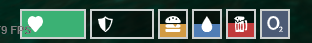

# A simple HUD for ESX with Health, Armor, Hunger, Thirst, Drunk, Oxygen.

To make the Hunger, Thirst, and Drunk status work you need to change the following in esx_status/client/main.lua:

TriggerEvent('esx_statushud:onTick', GetStatusData(true)) 

to

TriggerEvent('Hud:onTick', GetStatusData(true))

EXAMPLE:

	Citizen.CreateThread(function()
		while true do
			for i=1, #Status, 1 do
				Status[i].onTick()
			end

			SendNUIMessage({
				update = true,
				status = GetStatusData()
			})

			TriggerEvent('Hud:onTick', GetStatusData(true))  <-------- Here
			Citizen.Wait(Config.TickTime)
		end
	end)

Original Credits to [AlwahaL](https://github.com/AlwahaL) for [st-hud](https://github.com/AlwahaL/st-hud).
